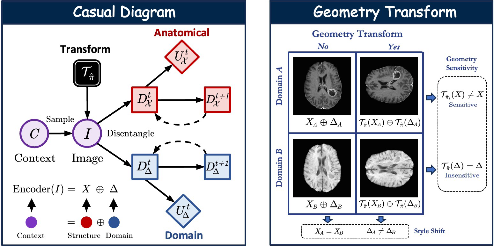
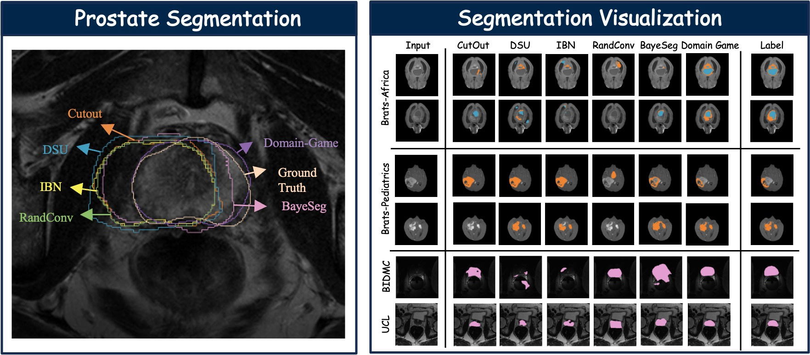
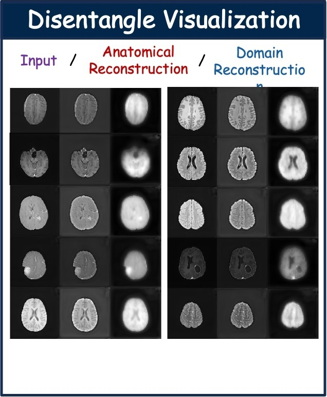

# [MICCAI'2024] Domain Game: Disentangle Anatomical Feature for Single Domain Generalized Segmentation
[__[arxiv]__](https://arxiv.org/abs/2406.02125) [__[poster]__](https://h-chen.com/assets/paper/2024/DomainGame/MICCAI2024-Poster-formal.pdf) Repository under construction. May still have some bugs 🚧


* 2024-07 Our paper has accepted by MICCAI 2024 *Computational Mathematics Modeling in Cancer Analysis Workshop* as Oral Presentation!
* 2024-06 arxiv version is online.

## Idea

The core idea of Domain Game is to improve feature disentanglement for single-domain generalization in medical image segmentation. Since only a single source domain is available, separating domain-invariant (anatomical) features from domain-specific features becomes inherently ill-posed due to the lack of cross-domain references.

To address this challenge, we leverage geometric transformations as a form of implicit supervision. Specifically, multiple randomly transformed versions of the same input image are generated and encoded into two distinct feature spaces: one capturing diagnostic (anatomical) features and the other representing domain-specific characteristics.

Based on the observation that anatomical structures are sensitive to geometric transformations while domain-related factors tend to remain invariant, we introduce a “game” mechanism in the feature space. This mechanism applies attraction and repulsion forces to encourage effective disentanglement between the two types of features. The overall concept is illustrated through a causal graph that models the relationships among image content, transformations, and learned representations.

 </p>

The effectiveness of the proposed method is demonstrated through segmentation results, showing improved generalization performance across domains.

 </p>

To further interpret the learned representations, we visualize the disentangled features by isolating each component and reconstructing the corresponding outputs, highlighting the separation between anatomical and domain-specific information.

<p align="center">
  
</p>

## Abstract
Single domain generalization aims to address the challenge of out-of-distribution generalization problem with only one source domain available. Feature distanglement is a classic solution to this purpose, where the extracted task-related feature is presumed to be resilient to domain shift. However, the absence of references from other domains in a single-domain scenario poses significant uncertainty in feature disentanglement (ill-posedness). In this paper, we propose a new framework, named Domain Game, to perform better feature distangling for medical image segmentation, based on the observation that diagnostic relevant features are more sensitive to geometric transformations, whilist domain-specific features probably will remain invariant to such operations. In domain game, a set of randomly transformed images derived from a singular source image is strategically encoded into two separate feature sets to represent diagnostic features and domain-specific features, respectively, and we apply forces to pull or repel them in the feature
space, accordingly. Results from cross-site test domain evaluation showcase approximately an ~11.8% performance boost in prostate segmentation and around ~10.5% in brain tumor segmentation compared to the second-best method.


## Initialization

Create an environment with conda:
```
mamba create -n DomainGame python=3.12
mamba activate DomainGame
```

Install required dependencies with:
```
mamba install -c pytorch pytorch torchvision torchaudio cudatoolkit=11.8 -y
mamba install -c conda-forge gxx -y
pip install -r requirements.txt 

# pip install torch 
pip install torch==2.3.1+cu121 torchvision==0.18.1+cu121 torchaudio \
            --extra-index-url https://download.pytorch.org/whl/cu121
```
## Dataset
### Brats 2023
Please goto [Brats-2023-synapse](https://www.synapse.org/#!Synapse:syn51156910/wiki/622341) to prepare the following datasets:.

    1. Segmentation - Adult Glioma
    2. Segmentation - BraTS-Africa
    3. Segmentation - Pediatric Tumors

run the following code to pre-process the data
```
cd process_data
python brain_seperate.py
```

## Utilization

### Training and Evaluation
```
follow the run_this_script.sh
```

### Log result saved in 
```
./result/<task>/<time>_train_<run_it>_<comment>
```
### Disentangle results saved in 
```
<log_dir>/image_dir
```
### Model saved in
```
<log_dir>/snapshot
```


## Acknowledgment

Our code has used the augmentation implementation from [Causality-inspired Single-source Domain Generalization for Medical Image Segmentation](https://github.com/cheng-01037/Causality-Medical-Image-Domain-Generalization). We thank their excellent works.

